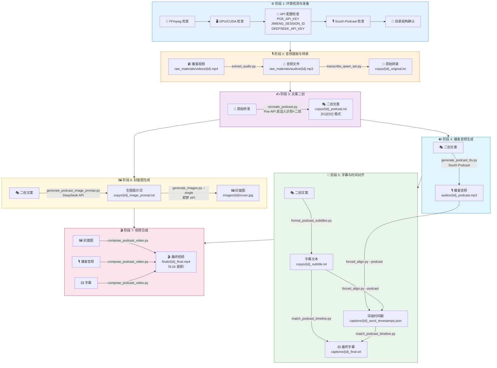
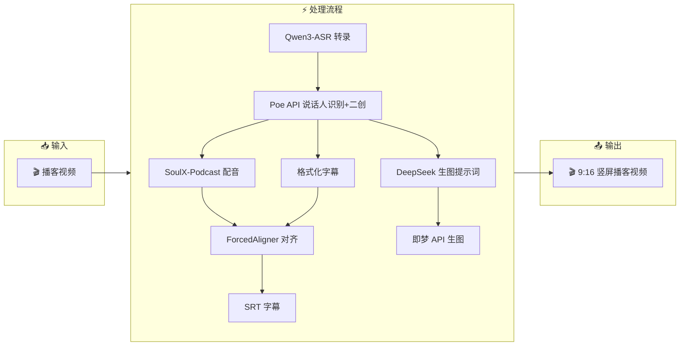

# 🎬 播客视频二创工作流程图

## 完整执行流程



---

## 📊 输入输出汇总表

| 阶段 | 脚本 | 输入 | 输出 |
|:----:|------|------|------|
| **1** | 环境检测 | `.env` 配置文件 | 环境就绪状态 |
| **2.1** | `extract_audio.py` | `videos/{id}.mp4` | `audios/{id}.mp3` |
| **2.2** | `transcribe_qwen_asr.py` | `audios/{id}.mp3` | `copys/{id}_original.txt` |
| **3** | `recreate_podcast.py` | `copys/{id}_original.txt` | `copys/{id}_podcast.txt` ([S1]/[S2]) |
| **4** | `generate_podcast_tts.py` | `copys/{id}_podcast.txt` | `audios/{id}_podcast.mp3` |
| **5.1** | `format_podcast_subtitles.py` | `copys/{id}_podcast.txt` | `copys/{id}_subtitle.txt` |
| **5.2** | `forced_align.py --podcast` | 音频 + 字幕文本 | `captions/{id}_word_timestamps.json` |
| **5.3** | `match_podcast_timeline.py` | 字幕 + 时间戳 | `captions/{id}_final.srt` |
| **6.1** | `generate_podcast_image_prompt.py` | `copys/{id}_podcast.txt` | `copys/{id}_image_prompt.txt` |
| **6.2** | `generate_images.py --single` | `copys/{id}_image_prompt.txt` | `images/{id}/cover.jpg` |
| **7** | `compose_podcast_video.py` | 图片 + 音频 + 字幕 | `finals/{id}_final.mp4` |

---

## 🔗 数据流向简图



---

## 📁 文件路径速查

```
raw_materials/
├── videos/{script_id}.mp4          ← 输入：播客视频
├── audios/
│   ├── {script_id}.mp3             ← 提取的原音频
│   └── {script_id}_podcast.mp3     ← SoulX-Podcast 生成
├── copys/
│   ├── {script_id}_original.txt    ← ASR 原始转录
│   ├── {script_id}_podcast.txt     ← 二创文案 [S1]/[S2]
│   ├── {script_id}_subtitle.txt    ← 字幕文本
│   └── {script_id}_image_prompt.txt ← 封面图提示词
├── captions/
│   ├── {script_id}_word_timestamps.json ← 词级时间戳
│   └── {script_id}_final.srt       ← 最终字幕
└── images/{script_id}/
    └── cover.jpg                   ← 封面图

finals/
└── {script_id}_final.mp4           ← 最终输出视频 (9:16)
```
